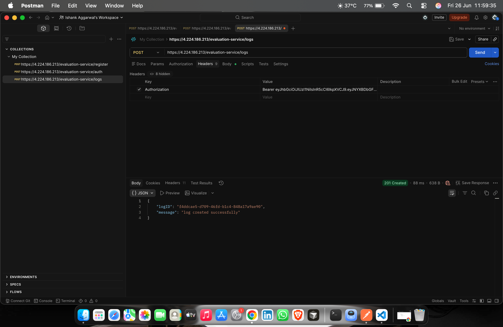
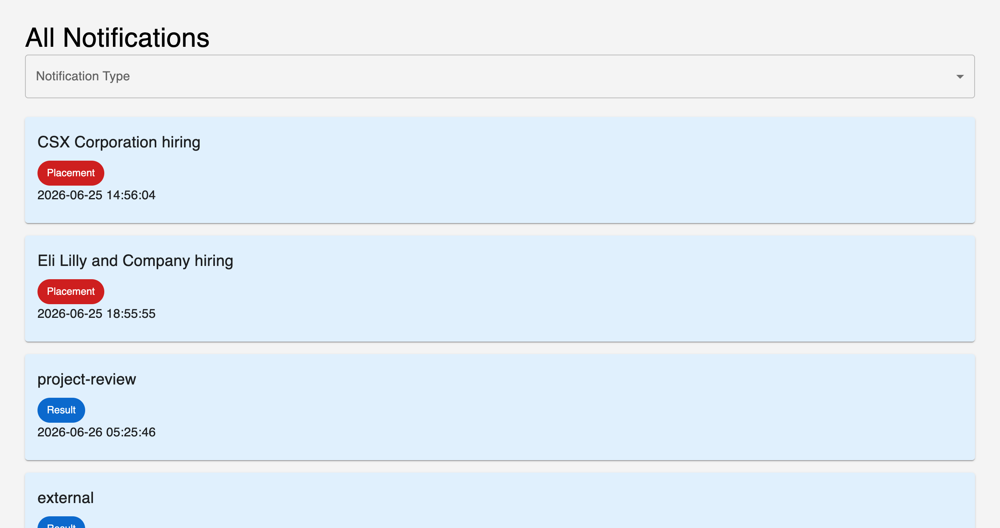
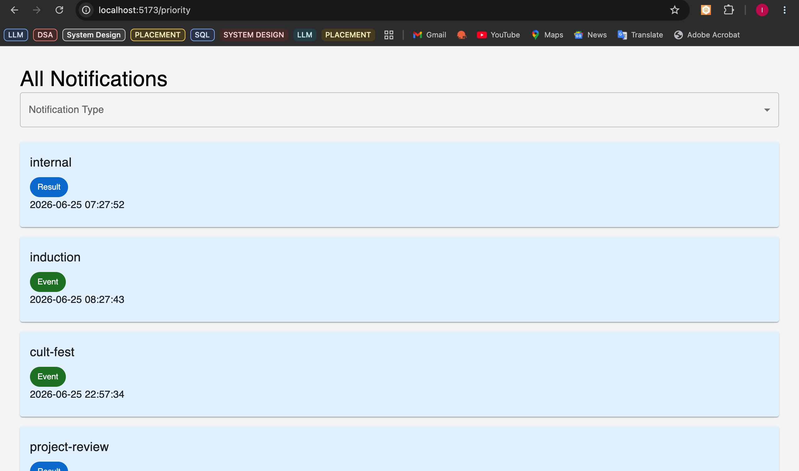

# Campus Evaluation Assignment

This repository contains my submission for the **Campus Evaluation Assignment**. The project demonstrates the design and implementation of a scalable notification system, covering API design, database modeling, performance optimization, priority notification handling, and a responsive React frontend.

---

## 🚀 Completed Stages

- ✅ Stage 1 – REST API Design & Notification Contract
- ✅ Stage 2 – Database Design & Storage Strategy
- ✅ Stage 3 – Query Optimization & Indexing
- ✅ Stage 4 – Performance Improvements & Caching Strategies
- ✅ Stage 5 – Reliable Notification Delivery Architecture
- ✅ Stage 6 – Priority Inbox Algorithm
- ✅ Stage 7 – React Frontend Application

---

## 🛠️ Tech Stack

### Frontend
- React
- Vite
- Material UI
- JavaScript (ES6+)

### Backend / Concepts
- REST APIs
- Logging Middleware
- JWT Authentication

### Database (Design)
- PostgreSQL / MySQL
- Indexing & Query Optimization

---

## 📂 Repository Structure

```text
Campus-Evaluation-FS/
│
├── logging-middleware/
├── notification-app-be/
├── notification-app-fe/
├── PriorityInbox.js
├── notification-system-design.md
├── images/
│   ├── output-1.png
│   ├── output-2.png 
│   └── postman.png
│
├── README.md
└── LICENSE   

```

---

# ✨ Features

- Notification REST API Integration
- JWT Protected API Access
- Responsive Material UI Interface
- Notification Type Filtering
- Pagination Support
- Priority Notification View
- Read / Unread Notification Handling
- Logging Middleware Integration
- Error & Loading States
- Modular React Architecture

---

# 📸 Screenshots

## 1️⃣ API Testing (Postman)

<p align="center">

</p>

---

## 2️⃣ Frontend Output – All Notifications

<p align="center">

</p>

---

## 3️⃣ Frontend Output – Priority Notifications

<p align="center">

</p>

---

# ▶️ Running the Project

### Clone Repository

```bash
git clone https://github.com/jayvar03/2301921520085.git
```

### Navigate to Frontend

```bash
cd notification-app-fe
```

### Install Dependencies

```bash
npm install
```

### Start Development Server

```bash
npm run dev
```

Application runs on:

```
http://localhost:5173
```

---

# 📄 Documents

- `notification_system_design.md` — Detailed solutions for Stages 1–6.
- `PriorityInbox.js` — Stage 6 implementation.
- `notification-app-fe/` — React frontend implementation for Stage 7.
- `logging-middleware/` — Logging middleware implementation.

---
